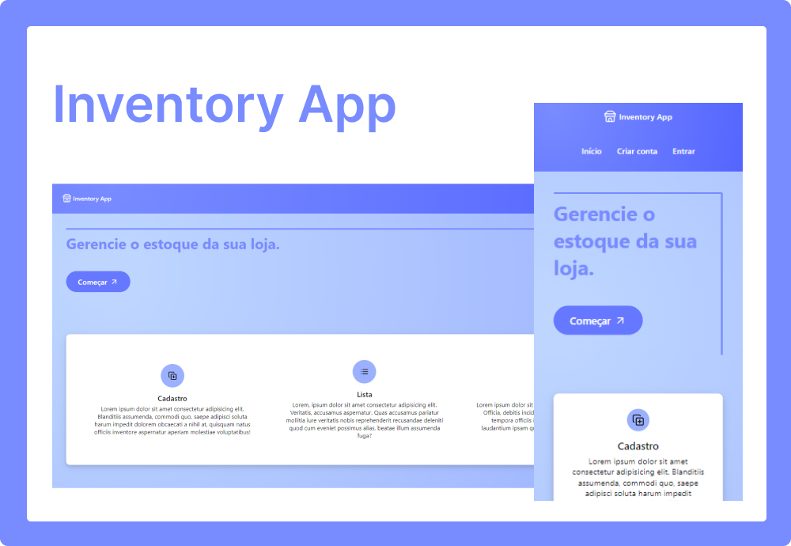

# Inventory App

Sistema web de gerenciamento de estoque.

## 💻 Projeto 

O projeto possui uma página de apresentação, permite que um usuário crie uma conta e faça login. Ele será autenticado e autorizado via JWT. Então, terá acesso às páginas em que ele poderá cadastrar seus produtos, editá-los, colocar fotos e excluí-los. Ele também poderá editar sua conta ou excluí-la. 

As páginas são responsivas e foi colocado um pequeno atraso na API para o componente "Loading" ser implementado e testado.

## 📸 Preview

  

## ✨ Principais Tecnologias 

**Front-end:** React, Vite, Redux, Redux Saga, Styled-Components, Axios

**Back-end:** Node, Express, Sequelize

## 📝 Licença 

Este projeto está sob a licença Apache. Veja o arquivo [LICENSE](LICENSE.txt) para mais detalhes.